# 🔗 Hybrid Identity Lab


> A hands-on hybrid identity environment combining on-premises Active Directory with Microsoft Entra ID (Azure AD), covering real-world enterprise identity management, Group Policy, and cloud synchronization scenarios.

---

## 📋 Project Overview

This lab simulates a hybrid enterprise environment where on-premises Windows Server 2022 infrastructure integrates with Microsoft Azure Entra ID. The environment is built on VMware Workstation using two Windows Server 2022 VMs connected via an isolated Host-only network, with Azure Entra ID as the cloud identity platform.

The lab is designed to demonstrate skills relevant to the **AZ-800: Administering Windows Server Hybrid Core Infrastructure** certification and real-world enterprise administration.

---

## 🏗️ Architecture

```
lab.hybrid.local (192.168.10.0/24)
├── DC01 (192.168.10.10)
│   ├── Active Directory Domain Services
│   ├── DNS Server
│   ├── Group Policy Management
│   └── Microsoft Entra Cloud Sync Agent (installed)
└── SERVER02 (192.168.10.20)
    ├── Domain Member Server
    └── File and Storage Services (planned)

Cloud
└── Microsoft Entra ID (Azure AD)
    └── Cloud Sync Configuration: lab.hybrid.local → Entra ID
        └── Status: Agent Active | Sync quarantined (home lab network restriction)
```

---

## 🛠️ Technologies Used

| Technology | Purpose |
|---|---|
| VMware Workstation | Hypervisor for local lab VMs |
| Windows Server 2022 | On-premises infrastructure (DC01, SERVER02) |
| Active Directory Domain Services | Identity and authentication |
| DNS Server | Name resolution for domain |
| Group Policy (GPO) | Centralized policy management |
| Microsoft Entra ID | Cloud identity platform |
| Microsoft Entra Cloud Sync | Modern hybrid identity synchronization agent |
| PowerShell | Automation and configuration |

---

## 📁 Repository Structure

```
hybrid-identity-lab/
├── README.md
├── docs/
│   └── screenshots/
│       ├── 01-vmnet10-configured.png
│       ├── 02-dc01-vm-settings-iso.png
│       ├── 03-dc01-static-ip-configured.png
│       ├── 04-adds-role-installed.png
│       ├── 06-domain-controller-verified.png
│       ├── 07-ou-structure-created.png
│       ├── 08-test-users-created.png
│       ├── 09-server02-vm-created.png
│       ├── 10-server02-static-ip.png
│       ├── 11-server02-domain-join.png
│       ├── 12-server02-joined-domain.png
│       ├── 13-gpmc-opened.png
│       ├── 14-gpo-password-policy.png
│       ├── 15-gpo-lockout-policy.png
│       ├── 16-gpo-desktop-policy.png
│       ├── 17-gpresult-server02.png
│       ├── 18-gpmc-policies-overview.png
│       ├── 19-entra-tenant-domain.png
│       ├── 20-upn-suffix-added.png
│       ├── 21-users-upn-updated.png
│       ├── 23-aadconnect-installer-start.png
│       ├── 26-syncadmin-created.png
│       ├── 27-aadconnect-signin-config.png
│       ├── 28-cloud-sync-agents-empty.png
│       ├── 29-cloud-sync-configure-service-account.png
│       ├── 30-cloud-sync-agent-confirm.png
│       ├── 31-cloud-sync-agent-complete.png
│       ├── 32-cloud-sync-agent-active.png
│       ├── 33-cloud-sync-new-configuration.png
│       ├── 34-cloud-sync-configuration-created.png
│       ├── 35-cloud-sync-review-enable.png
│       ├── 36-cloud-sync-configuration-enabled.png
│       ├── 37-cloud-sync-agent-service-running.png
│       ├── 38-cloud-sync-network-adapters.png
│       └── 39-cloud-sync-connectivity-test.png
└── scripts/
    ├── dc01-initial-setup.ps1
    ├── create-ou-structure.ps1
    ├── create-test-users.ps1
    └── update-upn-suffix.ps1
```

---

## 🚀 Lab Progress

### ✅ Module 1 — VMware Environment Setup

Configured an isolated Host-only network (`VMnet10`, `192.168.10.0/24`) with DHCP disabled for manual IP management. Created the DC01 virtual machine with 2 vCPUs, 2GB RAM, and 60GB storage, attached to the Windows Server 2022 ISO.

| Screenshot | Description |
|---|---|
|  | VMnet10 Host-only network configured |
|  | DC01 VM settings with ISO attached |
|  | Static IP 192.168.10.10 configured on DC01 |

---

### ✅ Module 2 — Active Directory Domain Services

Installed the AD DS role and promoted DC01 to Domain Controller for the `lab.hybrid.local` domain. Created a structured OU hierarchy and provisioned test users for later sync with Entra ID.

**Domain:** `lab.hybrid.local`
**NetBIOS Name:** `LAB`
**Domain Controller:** `DC01.lab.hybrid.local` (192.168.10.10)
**FSMO Roles:** All roles held by DC01 (SchemaMaster, DomainNamingMaster, PDCEmulator, RIDMaster, InfrastructureMaster)

**OU Structure:**
```
lab.hybrid.local
└── HybridLab
    ├── Users
    ├── Computers
    ├── Groups
    └── ServiceAccounts
```

**Test Users Created:**

| User | SAM Account | Department |
|---|---|---|
| Alice Johnson | alice.johnson | IT |
| Bob Smith | bob.smith | Finance |
| Carol White | carol.white | HR |

| Screenshot | Description |
|---|---|
|  | AD DS role installation — Success |
|  | Domain controller verified via Get-ADDomain and Get-ADDomainController |
|  | OU structure created in ADUC |
|  | Test users created in OU=Users |

---

### ✅ Module 3 — SERVER02 Deployment and Domain Join

Created and configured a second Windows Server 2022 VM (SERVER02) as a domain member server. Assigned static IP `192.168.10.20` with DNS pointing to DC01, then joined the `lab.hybrid.local` domain.

| Screenshot | Description |
|---|---|
|  | SERVER02 VM settings |
|  | Static IP 192.168.10.20 assigned |
|  | Domain join process |
|  | SERVER02 verified in AD — both DC01 and SERVER02 confirmed |

---

### ✅ Module 4 — Group Policy Objects (GPO)

Configured two GPOs to demonstrate centralized policy management across the domain. Verified GPO application on SERVER02 using `gpresult /r`.

**GPO 1 — Security-PasswordPolicy** (linked to domain root):

| Setting | Value |
|---|---|
| Minimum password length | 8 characters |
| Maximum password age | 90 days |
| Minimum password age | 1 day |
| Enforce password history | 5 passwords |
| Password complexity | Enabled |
| Account lockout threshold | 5 invalid attempts |
| Account lockout duration | 15 minutes |
| Reset lockout counter | 15 minutes |

**GPO 2 — User-DesktopPolicy** (linked to OU=HybridLab):

| Setting | Value |
|---|---|
| Prevent changing desktop background | Enabled |
| Screen saver timeout | 600 seconds |

| Screenshot | Description |
|---|---|
|  | Group Policy Management Console |
|  | Password Policy settings |
|  | Account Lockout Policy settings |
|  | User Desktop Policy — Personalization settings |
|  | GPO verification on SERVER02 — Security-PasswordPolicy applied |
|  | GPMC overview showing full GPO and OU structure |

---

### ✅ Module 5 — Azure Entra ID Integration (Cloud Sync)

Configured hybrid identity synchronization between the on-premises Active Directory and Microsoft Entra ID using **Microsoft Entra Cloud Sync** — the modern recommended replacement for the legacy Entra Connect Sync tool.

**Tenant:** `kotsvagg83gmail.onmicrosoft.com`
**Sync Tool:** Microsoft Entra Cloud Sync
**Sync Method:** Password Hash Synchronization (PHS)
**Sync Direction:** AD → Microsoft Entra ID

#### What was accomplished:

**UPN Preparation (carried over from initial setup):**

Added the `onmicrosoft.com` UPN suffix to the on-premises AD forest and updated all user UPNs to match the cloud tenant domain — a critical prerequisite for hybrid identity sync to function correctly.

```
alice.johnson@kotsvagg83gmail.onmicrosoft.com
bob.smith@kotsvagg83gmail.onmicrosoft.com
carol.white@kotsvagg83gmail.onmicrosoft.com
```

**Cloud Sync Agent Installation on DC01:**

Downloaded and installed the Microsoft Entra Provisioning Agent directly on DC01. During installation, a **Group Managed Service Account (gMSA)** was automatically created (`lab.hybrid.local\provAgentgMSA`) — a best-practice service account with auto-rotating passwords, requiring no manual credential management.

The agent was authenticated to Entra ID using the dedicated `syncadmin@kotsvagg83gmail.onmicrosoft.com` account (a native `.onmicrosoft.com` account with Global Administrator role), as the primary Gmail-based account is treated as a Guest in certain administrative contexts.

**Cloud Sync Configuration:**

Created a new Cloud Sync configuration in the Entra Admin Center targeting `lab.hybrid.local` with Password Hash Sync enabled. The agent registered successfully and appeared as **Active** in the Entra portal.

| Step | Result |
|---|---|
| Agent installation | ✅ Complete |
| gMSA service account creation | ✅ Automatic |
| Agent registration in Entra ID | ✅ Active |
| Cloud Sync configuration created | ✅ Complete |
| Password Hash Sync enabled | ✅ Enabled |
| Full user sync to Entra ID | ⚠️ Quarantined (see below) |

#### Troubleshooting — HybridIdentityServiceAgentTimeout:

After enabling the configuration, the sync entered a **quarantined** state with a `HybridIdentityServiceAgentTimeout` error. A systematic troubleshooting process was conducted to identify the root cause:

```powershell
# Step 1 — Verify agent service is running
Get-Service -Name "Microsoft Azure AD Connect Provisioning Agent" | Select Status, DisplayName
# Result: Running ✅

# Step 2 — Verify basic internet connectivity
Test-NetConnection -ComputerName "login.microsoftonline.com" -Port 443
# Result: TcpTestSucceeded: True ✅

# Step 3 — Check network interfaces
Get-NetIPAddress -AddressFamily IPv4 | Select InterfaceAlias, IPAddress
# Result: Ethernet0 (192.168.10.10), Ethernet1 (192.168.50.139 - NAT) ✅

# Step 4 — Test Microsoft App Proxy endpoint (critical for Cloud Sync agent)
Test-NetConnection -ComputerName "proxy-hsgeneral-weur-ams01p-3.his.msapproxy.net" -Port 443
# Result: TcpTestSucceeded: False ❌

# Step 5 — Test Azure Service Bus connectivity
Test-NetConnection -ComputerName "servicebus.windows.net" -Port 443
Test-NetConnection -ComputerName "servicebus.windows.net" -Port 5671
# Result: Both False ❌
```

**Root Cause:** The home lab network (ISP router/firewall) blocks outbound connections to Microsoft App Proxy and Service Bus endpoints — the specific communication channels used by the Cloud Sync agent to relay data to Azure. Basic HTTPS connectivity to general internet endpoints works, but the Microsoft-specific proxy infrastructure endpoints are unreachable.

> **Note:** This is a known limitation of home lab environments. In enterprise environments, these endpoints are reachable via corporate internet egress or ExpressRoute. The required endpoints are documented in [Microsoft's Cloud Sync prerequisites](https://learn.microsoft.com/en-us/entra/identity/hybrid/cloud-sync/how-to-prerequisites).

| Screenshot | Description |
|---|---|
| 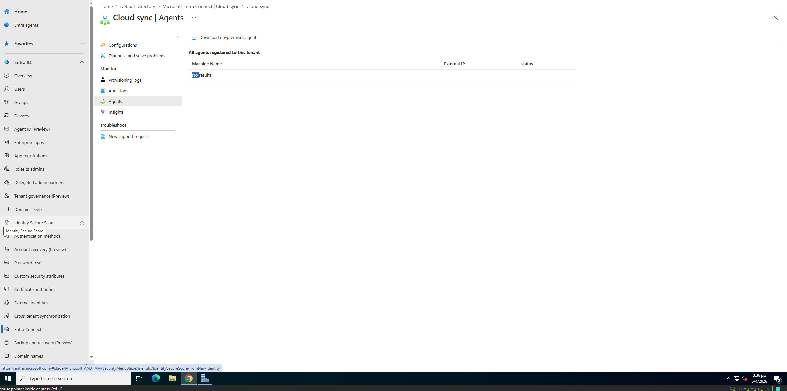 | Entra Cloud Sync — no agents registered yet |
|  | Agent installer — Configure Service Account (gMSA) |
| 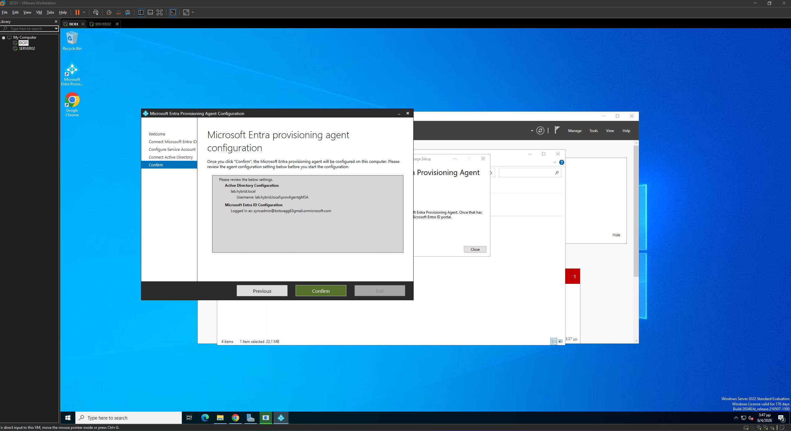 | Agent configuration summary before confirmation |
| 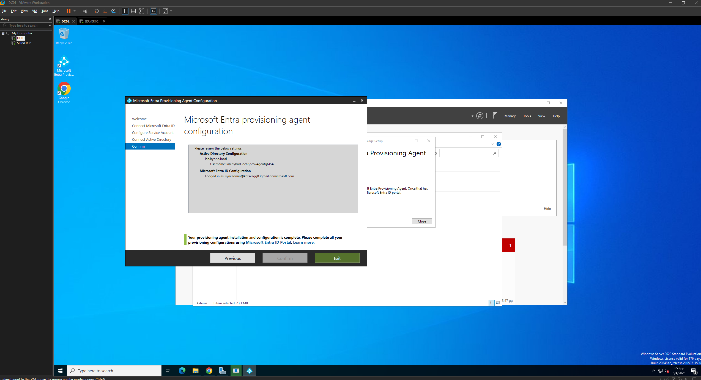 | Agent installation complete |
| 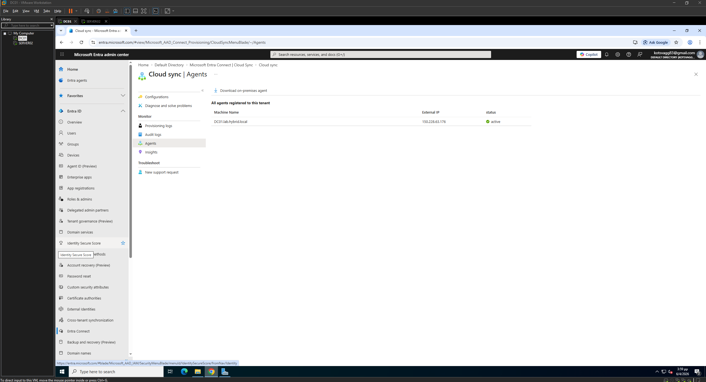 | DC01.lab.hybrid.local registered as Active in Entra ID |
| 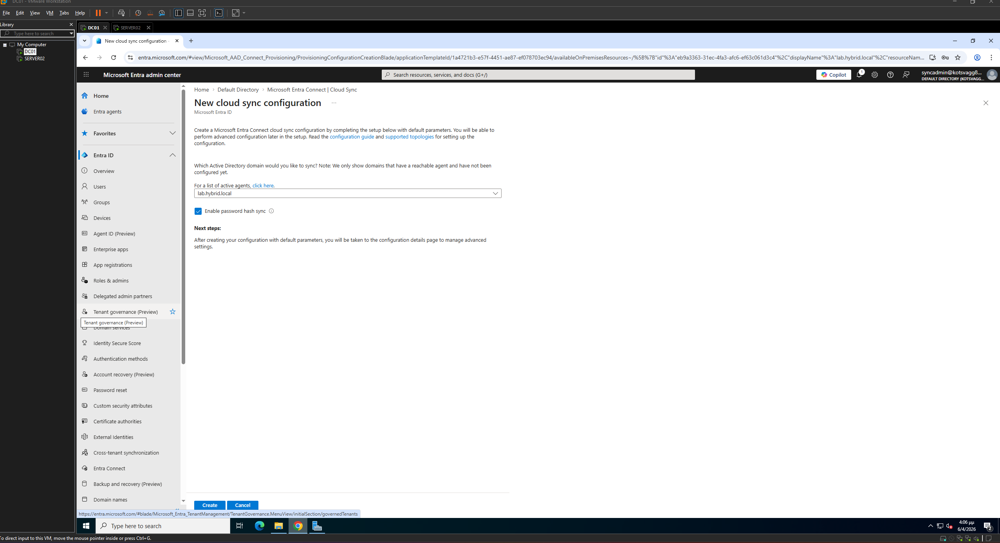 | New Cloud Sync configuration — lab.hybrid.local selected |
| 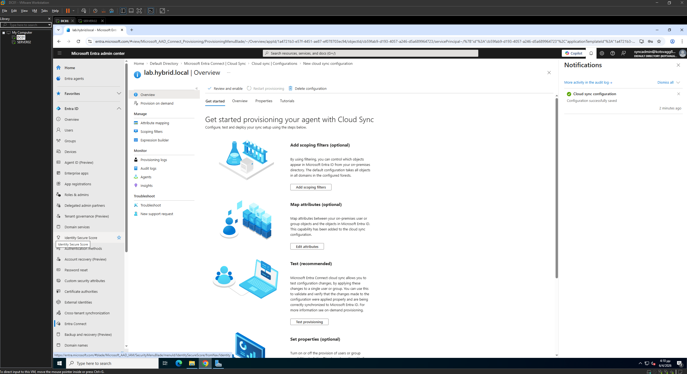 | Configuration successfully saved |
| 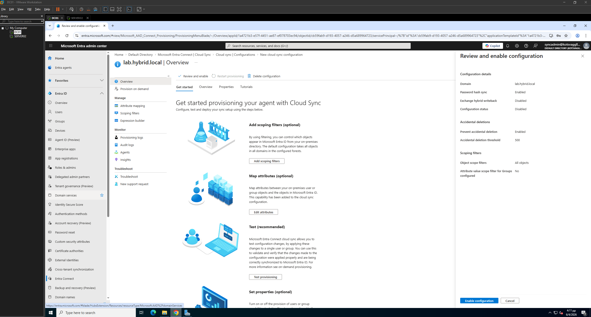 | Review and enable — all settings confirmed |
| 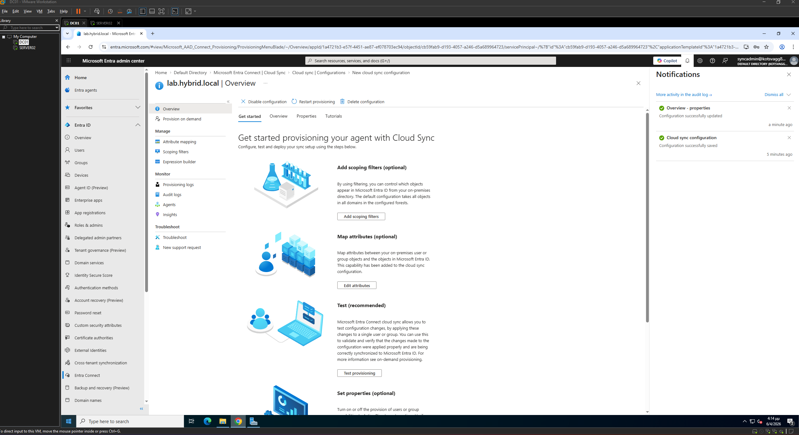 | Configuration enabled — provisioning started |
| 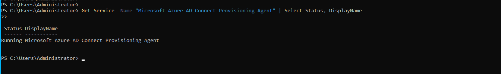 | PowerShell — Agent service confirmed Running on DC01 |
| 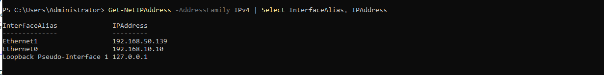 | PowerShell — Network adapters and IPs on DC01 |
| 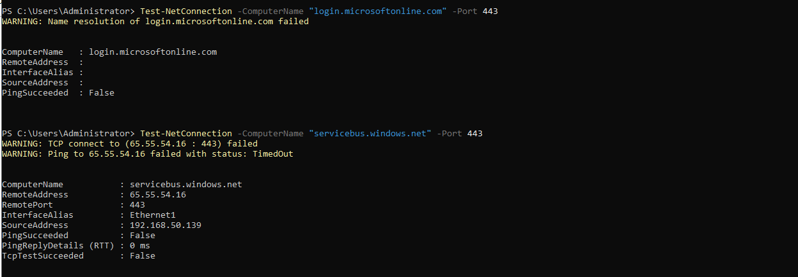 | PowerShell — Connectivity tests showing blocked endpoints |

---

### 📋 Planned — Module 6 and Beyond

- [ ] Configure DHCP server role on DC01
- [ ] Deploy File Services role on SERVER02
- [ ] Configure DFS Namespace
- [ ] Deploy Hyper-V role on SERVER02
- [ ] Azure Arc integration for on-premises server management
- [ ] Azure Monitor / Defender for Cloud onboarding

---

## 🔑 Key Concepts Demonstrated

**Hybrid Identity** — Users exist simultaneously in on-premises AD and Azure Entra ID, synchronized via Entra Cloud Sync. This is the most common enterprise identity architecture for organizations in transition to the cloud.

**Domain Controller promotion** — Using `Install-ADDSForest` to configure a new AD forest, including DNS integration and FSMO role assignment.

**OU-based administration** — Organizing AD objects into Organizational Units to enable targeted Group Policy application and delegation of control.

**Group Policy** — Centralized enforcement of security baselines (password complexity, account lockout) and user experience settings across all domain-joined machines without touching them individually.

**UPN suffix alignment** — Ensuring on-premises user UPNs match the cloud tenant domain before sync — a critical prerequisite for hybrid identity to function correctly.

**Group Managed Service Accounts (gMSA)** — Automatically provisioned service accounts with auto-rotating passwords, used by the Cloud Sync agent for secure operation without manual credential management.

**Hybrid Identity Troubleshooting** — Systematic verification of agent health, network connectivity, and required Microsoft endpoints to diagnose sync failures in hybrid environments.

---

## ⚠️ Known Issues and Troubleshooting Notes

**AADSTS700027 — Expired certificate on Entra Connect application:**
During initial Entra Connect Sync setup, the installer failed with a service principal certificate expiry error. This is a known issue with specific versions of Connect Sync on free-tier tenants. Resolution: migrated to **Entra Cloud Sync**, the modern recommended replacement as of 2024.

**Non-routable domain warning:**
The on-premises domain `lab.hybrid.local` uses a `.local` suffix which is non-routable and cannot be verified in Azure. This is expected in lab environments. Mitigation: add the `onmicrosoft.com` tenant domain as a UPN suffix in AD and update all user UPNs before sync.

**HybridIdentityServiceAgentTimeout — Home lab network restriction:**
The Cloud Sync agent requires outbound access to Microsoft App Proxy endpoints (`*.msapproxy.net`) and Azure Service Bus (`servicebus.windows.net`, ports 443 and 5671). These are blocked by home ISP routers/firewalls, preventing the agent from relaying sync data to Azure. In enterprise environments this is resolved via corporate egress policies or ExpressRoute. The agent itself is correctly installed, registered, and running — the limitation is purely at the network layer.

**Guest user restriction on Configurations page:**
The primary `kotsvagg83@gmail.com` account (external/Microsoft Account) was treated as a Guest user in certain Entra admin contexts, blocking access to Cloud Sync Configurations. Resolution: use the native `.onmicrosoft.com` admin account (`syncadmin@kotsvagg83gmail.onmicrosoft.com`) for Cloud Sync configuration tasks.

---

## 🧰 PowerShell Scripts

### dc01-initial-setup.ps1
```powershell
# Rename computer and configure static IP
Rename-Computer -NewName "DC01" -Restart

New-NetIPAddress -InterfaceAlias "Ethernet0" -IPAddress 192.168.10.10 -PrefixLength 24 -DefaultGateway 192.168.10.1
Set-DnsClientServerAddress -InterfaceAlias "Ethernet0" -ServerAddresses 127.0.0.1
```

### create-ou-structure.ps1
```powershell
New-ADOrganizationalUnit -Name "HybridLab" -Path "DC=lab,DC=hybrid,DC=local"
New-ADOrganizationalUnit -Name "Users" -Path "OU=HybridLab,DC=lab,DC=hybrid,DC=local"
New-ADOrganizationalUnit -Name "Computers" -Path "OU=HybridLab,DC=lab,DC=hybrid,DC=local"
New-ADOrganizationalUnit -Name "Groups" -Path "OU=HybridLab,DC=lab,DC=hybrid,DC=local"
New-ADOrganizationalUnit -Name "ServiceAccounts" -Path "OU=HybridLab,DC=lab,DC=hybrid,DC=local"
```

### create-test-users.ps1
```powershell
$Users = @(
    @{Name="Alice Johnson"; SamAccount="alice.johnson"; Department="IT"},
    @{Name="Bob Smith"; SamAccount="bob.smith"; Department="Finance"},
    @{Name="Carol White"; SamAccount="carol.white"; Department="HR"}
)

$Password = ConvertTo-SecureString "UserPass@2024!" -AsPlainText -Force

foreach ($u in $Users) {
    New-ADUser `
        -Name $u.Name `
        -SamAccountName $u.SamAccount `
        -UserPrincipalName "$($u.SamAccount)@lab.hybrid.local" `
        -Path "OU=Users,OU=HybridLab,DC=lab,DC=hybrid,DC=local" `
        -Department $u.Department `
        -AccountPassword $Password `
        -Enabled $true `
        -PasswordNeverExpires $true
}
```

### update-upn-suffix.ps1
```powershell
# Add cloud UPN suffix to AD forest
Get-ADForest | Set-ADForest -UPNSuffixes @{Add="kotsvagg83gmail.onmicrosoft.com"}

# Update all users in HybridLab OU
$NewSuffix = "kotsvagg83gmail.onmicrosoft.com"
$Users = Get-ADUser -Filter * -SearchBase "OU=Users,OU=HybridLab,DC=lab,DC=hybrid,DC=local"

foreach ($user in $Users) {
    $NewUPN = $user.SamAccountName + "@" + $NewSuffix
    Set-ADUser $user -UserPrincipalName $NewUPN
}
```

---

*Part of my cybersecurity and infrastructure portfolio — [evangelos-kotsis.github.io/My-CV-Page](https://evangelos-kotsis.github.io/My-CV-Page/)*
